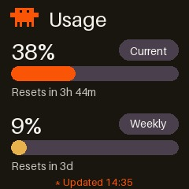
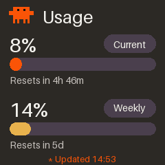
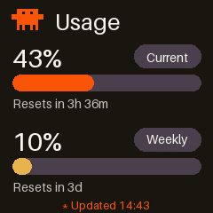
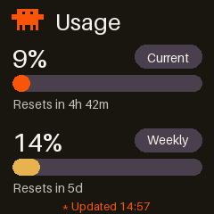

# geekmagic-claude-usage

Show your [Claude Code](https://claude.ai/code) `/usage` limits — the same
"Current session" / "Current week" numbers `/usage` prints in your terminal
— on a [GeekMagic](https://geekmagic.cc/) SmallTV's screen, with a little
animated pixel-art mascot. **No firmware reflash required** — it uses the
device's stock, unmodified web API.



## How it works

1. It shells out to your already-authenticated Claude Code CLI:
   `claude -p --safe-mode --output-format json --max-budget-usd 0.000001 --tools "" --no-session-persistence /usage`
   This runs Claude Code's own built-in `/usage` command in a locked-down,
   zero-tool mode. The script double-checks the response reports
   `total_cost_usd == 0` and zero token usage before trusting it — **this
   never spends a token**.
2. It parses the two lines `/usage` prints (`Current session: NN% used ·
   resets ...` and `Current week: NN% used · resets ...`) into percentages
   and reset timestamps.
3. It renders a 240×240 animated GIF with [Pillow](https://python-pillow.org/):
   a pixel-art mascot doing something (see [Animations](#animations)) plus
   two usage bars, styled after Claude's own warm/orange palette.
4. It uploads that GIF straight to the device over HTTP
   (`POST /doUpload?dir=/image/`), switches the device to its Photo Album
   theme (`GET /set?theme=3`), and pins the new GIF as the displayed image
   (`GET /set?img=/image/claude-usage.gif`).

No custom firmware, no soldering, nothing installed on the device — it's
just three plain HTTP calls to the web server the device already runs out
of the box.

## Requirements

- A GeekMagic SmallTV running the stock **[GeekMagicClock/smalltv-ultra](https://github.com/GeekMagicClock/smalltv-ultra)**
  firmware (confirm by opening `http://<device-ip>/settings.html` — the page
  links back to that repo). Other GeekMagic firmware families (SD_RU/SD Pro
  community firmware, the ESP32 "PRO" `.sys` variant) use a **different**
  API and are not supported by this script as-is.
- [Claude Code](https://claude.ai/code) installed and logged in on the
  machine that will run this script (that's what `/usage` reads from).
- Python 3.11+ and [Pillow](https://python-pillow.org/) (`pip install Pillow`
  or `pip3 install Pillow`).
- The device and this machine on the same local network.

## Quick start

```bash
git clone https://github.com/RubenU2002/geekmagic-claude-usage.git
cd geekmagic-claude-usage
pip3 install Pillow

# find your device's IP (check your router, or the device's own screen/menu)
python3 geekmagic_claude.py --ip 192.168.1.18
```

That single run renders one frame set, uploads it, and exits. To see it
updating continuously without any OS-level automation, use `--loop`:

```bash
python3 geekmagic_claude.py --ip 192.168.1.18 --loop 60
```

## Animations

Pass `--animation NAME` (default: `laptop`). All of them live side by side
in the `ANIMATIONS` dict in `geekmagic_claude.py` — picking one never
deletes another, and adding a new one is just adding a new entry.

<table>
<tr>
  <td align="center"><br><code>idle</code></td>
  <td align="center"><br><code>laptop</code></td>
  <td align="center"><br><code>coffee</code></td>
</tr>
<tr>
  <td align="center">Just the mascot's gentle idle bob</td>
  <td align="center">Pulls a tiny laptop up into view and holds it</td>
  <td align="center">Pulls out a mug of coffee, with steam wisps rising</td>
</tr>
<tr>
  <td align="center"><br><code>eureka</code></td>
  <td align="center"><br><code>dance</code></td>
  <td align="center"><br><code>typing</code></td>
</tr>
<tr>
  <td align="center">A little idea spark pops up beside its head</td>
  <td align="center">A side-to-side wiggle dance</td>
  <td align="center">Like <code>laptop</code>, plus a moving cursor on the little screen</td>
</tr>
</table>

`random` picks a different one from the list above on every push.

```bash
python3 geekmagic_claude.py --ip 192.168.1.18 --animation coffee
```

### Adding your own

Each animation is a tuple of `(mascot_dx, mascot_dy, extra)` per GIF frame,
where `extra` is an optional `(image, mascot_width) -> None` drawing hook
(see `_laptop_layer`, `_mug_layer`, `_bulb_layer` for examples — each closes
over a 0..1 "reveal progress" and draws a small pixel-art prop rising into
frame). Chain more than one hook with `_combine(...)` (used by `typing` to
overlay a cursor on top of the held laptop). Define a small bitmap (a tuple
of equal-length strings, one character per pixel), a tiny `_draw_x` function,
a `_x_layer(...)` closure, then add a new key to `ANIMATIONS`.

## Running it automatically (macOS)

The included `com.example.geekmagic-claude.plist` is a
[launchd](https://www.launchd.info/) LaunchAgent — macOS's native way to run
something in the background, starting at login and re-running on a timer.

1. Copy it and fill in the placeholders:
   ```bash
   cp com.example.geekmagic-claude.plist ~/Library/LaunchAgents/com.yourname.geekmagic-claude.plist
   ```
   Edit that copy:
   - `Label` — make it match the filename (e.g. `com.yourname.geekmagic-claude`)
   - The `python3` path — run `which python3` and use that exact path
   - The path to `geekmagic_claude.py` — wherever you cloned this repo
   - `--ip` — your device's IP
   - Both `StandardOutPath`/`StandardErrorPath` — anywhere you want the log written

2. Load it:
   ```bash
   launchctl load ~/Library/LaunchAgents/com.yourname.geekmagic-claude.plist
   ```

It now runs once immediately (`RunAtLoad`) and every 60 seconds
(`StartInterval`) for as long as you're logged in, and restarts itself after
a reboot or logout/login — no need to keep a terminal open.

```bash
# watch it work
tail -f /path/to/your/log.txt

# pause it
launchctl unload ~/Library/LaunchAgents/com.yourname.geekmagic-claude.plist

# resume it
launchctl load ~/Library/LaunchAgents/com.yourname.geekmagic-claude.plist
```

**Gotcha:** if your script directory is under `~/Downloads`, `~/Desktop`, or
`~/Documents`, macOS's privacy protection (TCC) can block a launchd job
from reading it with a silent `Operation not permitted` in the log, even
though running it by hand in Terminal works fine (Terminal already has
disk access; a background launchd process does not inherit it). If you hit
that, move the folder somewhere else (e.g. `~/Library/Application
Support/geekmagic-claude-usage` or anywhere outside those four folders) and
update the plist paths.

**Gotcha:** launchd does not load your shell's `PATH`, so if `claude` is
installed somewhere like `/opt/homebrew/bin` (Homebrew on Apple Silicon),
add it to the plist's `EnvironmentVariables` (already done in the example
file) or the script won't find the `claude` executable.

Other platforms: use `cron`, a `systemd --user` timer, or Windows Task
Scheduler to run `python3 geekmagic_claude.py --ip ... --animation ...` on a
schedule instead.

## Firmware API reference (stock SmallTV Ultra)

Discovered by probing a real device; documented here since GeekMagic's own
docs don't cover it:

| Action | Endpoint |
|---|---|
| Upload an image/GIF | `POST /doUpload?dir=/image/` (multipart field `file`; same filename overwrites) |
| Pin it on screen | `GET /set?img=/image/<filename>` (requires Photo Album theme) |
| Switch to Photo Album | `GET /set?theme=3` |
| Delete a file | `GET /delete?file=/image/<filename>` |
| List files | `GET /filelist?dir=/image/` (HTML table) |
| Free space | `GET /space.json` |

Animated GIFs are decoded and looped **on the device itself** — one upload
per push, no per-frame network traffic. Keep GIFs well under the device's
free space (`/space.json`); this script's GIFs run 40–90 KB, comfortably
inside a device with a few hundred KB free.

## Why this exists / prior art

There are a few public projects that inspired pieces of this one:

- [MyrikLD/GeekMagic-Clawdmeter](https://github.com/MyrikLD/GeekMagic-Clawdmeter) —
  custom Rust firmware for the SmallTV PRO that reads Anthropic's
  undocumented `/api/oauth/usage` endpoint directly over WiFi. Closest in
  spirit, but it **replaces** the stock firmware entirely.
- [hsmloktar/geekmagic-ai-usage-monitor](https://github.com/hsmloktar/geekmagic-ai-usage-monitor) —
  the source of the "shell out to the local CLI's own usage command"
  approach used here, generalized across Codex and Claude.
- [epicsagas/AgentGlance](https://github.com/epicsagas/AgentGlance) — a
  Claude Code plugin that turns a GeekMagic SmallTV into a live
  WORKING/APPROVAL/DONE session-status display (context %, tokens) rather
  than an account-wide quota display; also the source of several of the
  stock-Ultra firmware API details documented above.

This script takes a different, narrower path than any of those: no
firmware changes, no OAuth, no Codex — just the local `claude /usage`
command and three plain HTTP calls.

## Disclaimer

The mascot is an original pixel-art design made for this project — it is
**not** an official Anthropic/Claude logo or asset, just a small creature
drawn in a similar warm/orange palette. This project is unaffiliated with
Anthropic and unaffiliated with GeekMagic; it talks to each of their
products only through the interfaces they already expose (Claude Code's
local `/usage` command, and the device's own stock HTTP API).

## License

MIT — do whatever you want with it.
